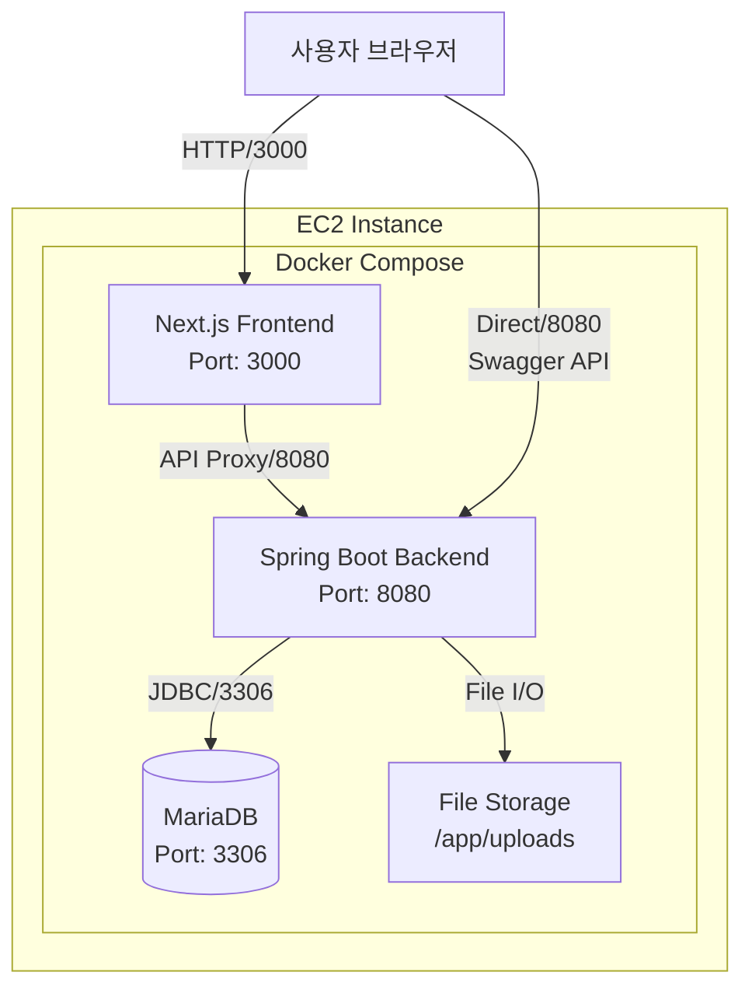
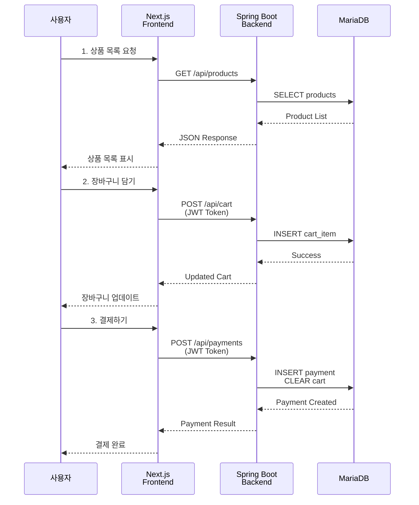
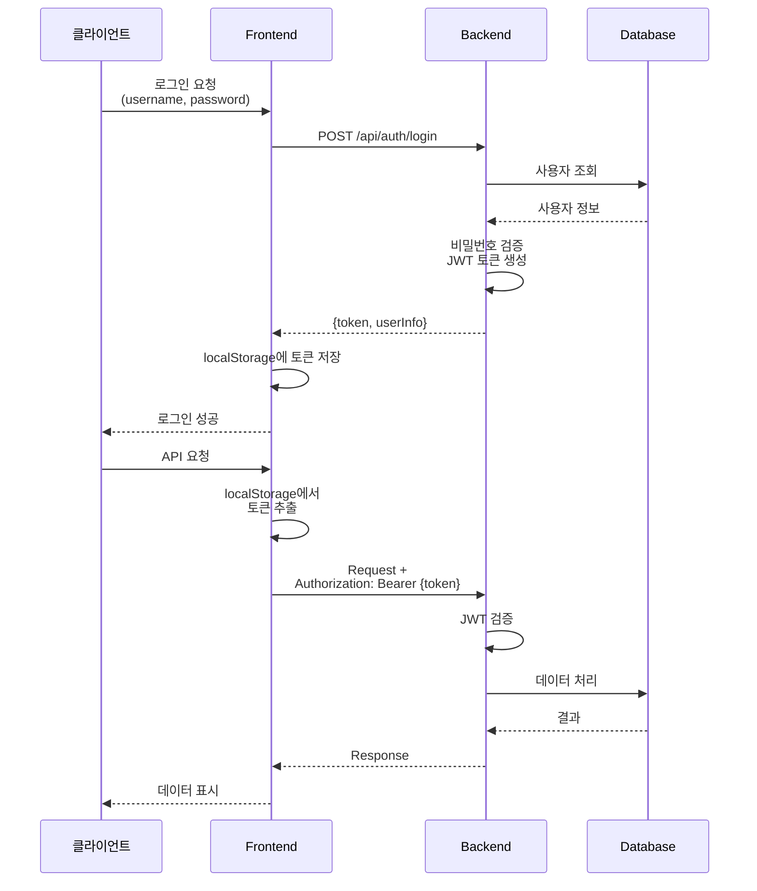
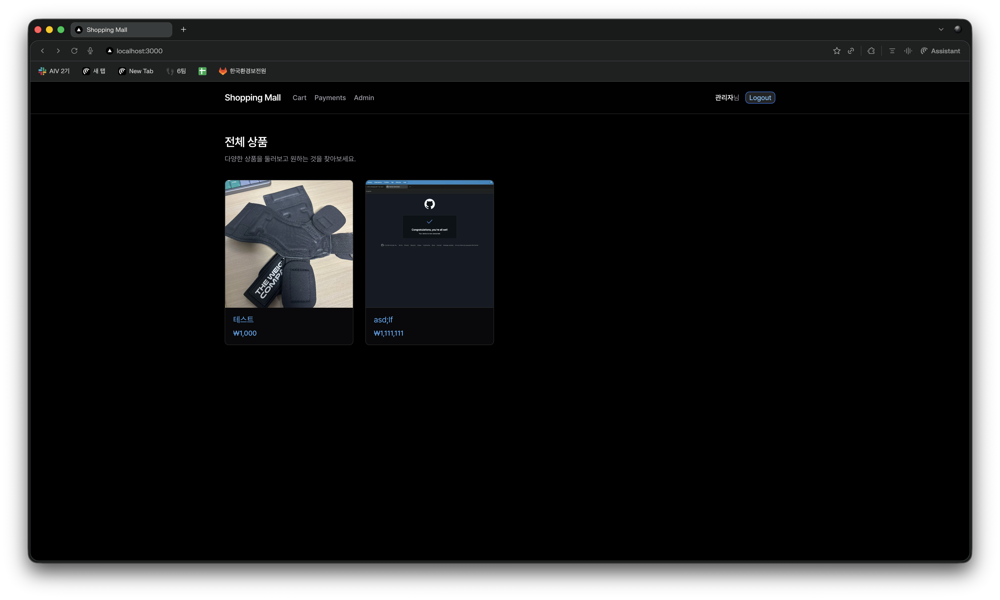
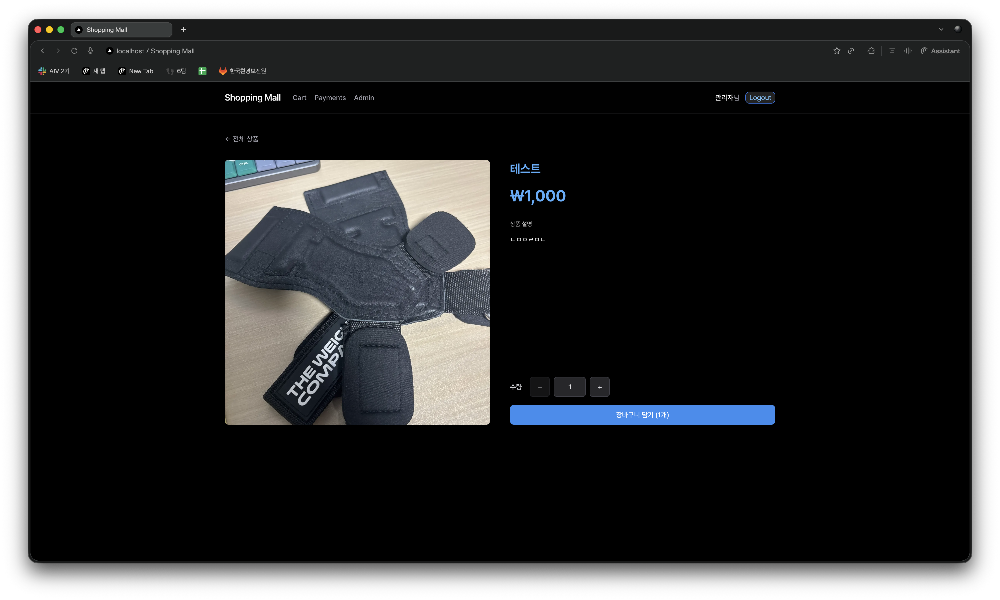
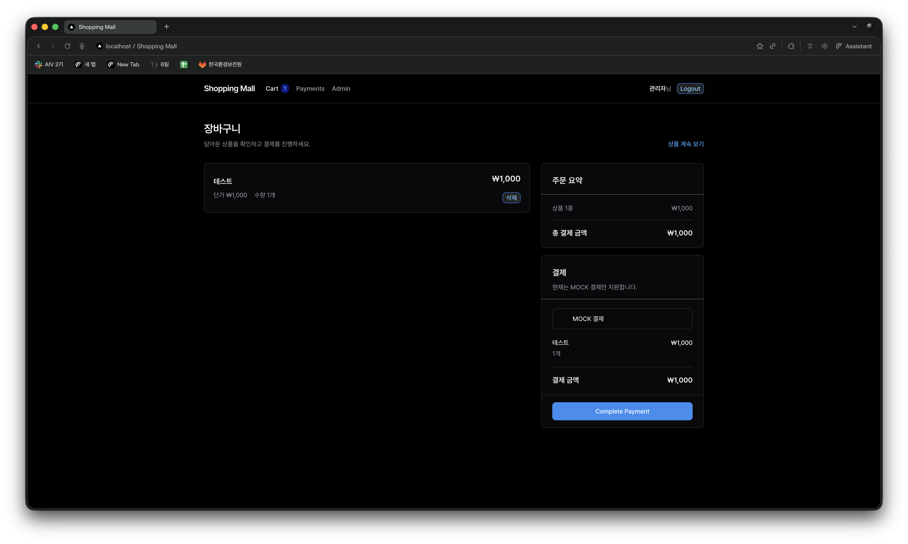
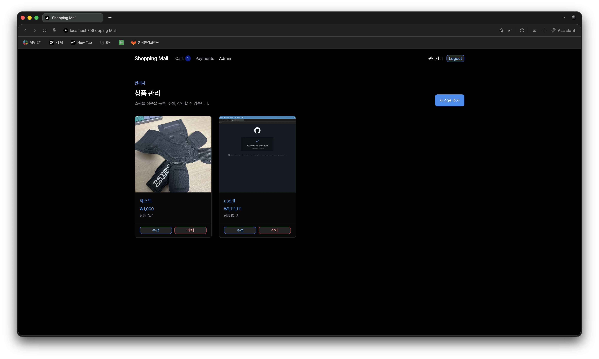
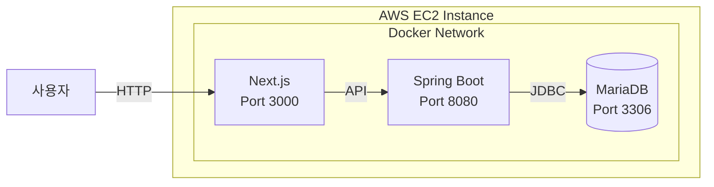

# 🛍️ 쇼핑몰 프로젝트 (Shopping Mall)

> Spring Boot + Next.js 기반의 풀스택 쇼핑몰 애플리케이션

[](https://spring.io/projects/spring-boot)
[](https://kotlinlang.org/)
[](https://nextjs.org/)
[](https://www.typescriptlang.org/)
[](https://docs.docker.com/compose/)
[](https://mariadb.org/)

## 📋 목차

- [프로젝트 개요](#프로젝트-개요)
- [시스템 아키텍처](#시스템-아키텍처)
- [기술 스택](#기술-스택)
- [프로젝트 구조](#프로젝트-구조)
- [화면 구성](#화면-구성)
- [API 문서](#api-문서)
- [시작하기](#시작하기)
- [테스트](#테스트)
- [배포 가이드](#배포-가이드)
- [테스트 계정](#테스트-계정)
- [환경 변수](#환경-변수)

## 🎯 프로젝트 개요

이 프로젝트는 **모노레포(Monorepo)** 구조로 구성된 풀스택 쇼핑몰 애플리케이션입니다. 백엔드는 Spring Boot(Kotlin)로, 프론트엔드는 Next.js(TypeScript)로 개발되었으며, Docker Compose로 손쉽게 배포할 수 있습니다.

### 주요 기능

| 기능 | 설명 | 접근 권한 |
|------|------|----------|
| **상품 조회** | 상품 목록 및 상세 정보 조회 | 누구나 |
| **회원가입/로그인** | JWT 기반 인증 시스템 | 누구나 |
| **장바구니** | 상품 추가, 수량 조절, 삭제 | 로그인 사용자 |
| **결제** | Mock 결제 시스템 (실제 결제 X) | 로그인 사용자 |
| **결제 내역** | 결제 내역 조회 및 상세 보기 | 로그인 사용자 |
| **상품 관리** | 상품 등록, 수정, 삭제, 이미지 업로드 | 관리자 |

## 🏗️ 시스템 아키텍처

### 전체 시스템 구조



### 데이터 흐름



### 인증 흐름



## 🛠️ 기술 스택

### Backend

| 기술 | 버전 | 용도 |
|------|------|------|
| **Kotlin** | 1.9+ | 프로그래밍 언어 |
| **Spring Boot** | 3.2+ | 웹 프레임워크 |
| **Spring Security** | 6.2+ | 인증/인가 |
| **JWT** | 0.12+ | 토큰 기반 인증 |
| **Spring Data JPA** | 3.2+ | ORM |
| **MariaDB** | 11.2 | 데이터베이스 |
| **Gradle** | 8.5+ | 빌드 도구 |

### Frontend

| 기술 | 버전 | 용도 |
|------|------|------|
| **Next.js** | 16 | React 프레임워크 |
| **TypeScript** | 5.0+ | 타입 시스템 |
| **Tailwind CSS** | 4.0 | 스타일링 |
| **Vapor UI** | 1.2 | UI 컴포넌트 라이브러리 |
| **React** | 19 | UI 라이브러리 |

### Infrastructure

| 기술 | 버전 | 용도 |
|------|------|------|
| **Docker** | 20.10+ | 컨테이너화 |
| **Docker Compose** | 2.0+ | 다중 컨테이너 오케스트레이션 |
| **Nginx** | - | 리버스 프록시 (선택) |

## 📁 프로젝트 구조

```
shopping-mall/
├── 📁 backend/                 # Spring Boot 애플리케이션
│   ├── 📁 src/main/kotlin/
│   │   └── 📁 gdfs/shopping/backend/
│   │       ├── 📁 config/      # 설정 클래스
│   │       │   ├── SecurityConfig.kt    # 보안 설정
│   │       │   ├── JwtTokenProvider.kt  # JWT 토큰 관리
│   │       │   └── WebConfig.kt         # 웹 설정
│   │       ├── 📁 controller/  # REST API 컨트롤러
│   │       │   ├── AuthController.kt    # 인증 API
│   │       │   ├── ProductController.kt # 상품 API
│   │       │   ├── CartController.kt    # 장바구니 API
│   │       │   ├── PaymentController.kt # 결제 API
│   │       │   └── 📁 admin/
│   │       │       └── AdminProductController.kt  # 관리자 API
│   │       ├── 📁 domain/      # 엔티티 및 리포지토리
│   │       │   ├── 📁 member/  # 사용자
│   │       │   ├── 📁 product/ # 상품
│   │       │   ├── 📁 cart/    # 장바구니
│   │       │   └── 📁 payment/ # 결제
│   │       ├── 📁 dto/         # 데이터 전송 객체
│   │       ├── 📁 security/    # JWT 필터
│   │       └── 📁 service/     # 비즈니스 로직
│   ├── 📄 Dockerfile           # 백엔드 도커 이미지
│   ├── 📄 build.gradle         # Gradle 설정
│   └── 📄 .env.example         # 환경 변수 예시
│
├── 📁 frontend/                # Next.js 애플리케이션
│   ├── 📁 app/                 # App Router 페이지
│   │   ├── 📄 page.tsx         # 홈 (상품 목록)
│   │   ├── 📄 layout.tsx       # 루트 레이아웃
│   │   ├── 📁 login/           # 로그인 페이지
│   │   ├── 📁 signup/          # 회원가입 페이지
│   │   ├── 📁 products/[id]/   # 상품 상세 페이지
│   │   ├── 📁 cart/            # 장바구니 페이지
│   │   ├── 📁 payments/        # 결제 내역 페이지
│   │   └── 📁 admin/products/  # 관리자 페이지
│   ├── 📁 components/          # React 컴포넌트
│   │   ├── 📁 auth/            # 인증 컴포넌트
│   │   ├── 📁 layout/          # 레이아웃 컴포넌트
│   │   ├── 📁 products/        # 상품 컴포넌트
│   │   ├── 📁 cart/            # 장바구니 컴포넌트
│   │   ├── 📁 payment/         # 결제 컴포넌트
│   │   └── 📁 admin/           # 관리자 컴포넌트
│   ├── 📁 hooks/               # 커스텀 React Hooks
│   │   ├── useAuth.ts          # 인증 상태 관리
│   │   ├── useCart.ts          # 장바구니 상태 관리
│   │   └── useProducts.ts      # 상품 데이터 관리
│   ├── 📁 lib/                 # 유틸리티
│   │   └── api.ts              # API 클라이언트
│   ├── 📁 types/               # TypeScript 타입
│   ├── 📄 Dockerfile           # 프론트엔드 도커 이미지
│   └── 📄 next.config.ts       # Next.js 설정
│
├── 📄 docker-compose.yml       # 통합 Docker Compose
├── 📄 .gitignore               # Git ignore 규칙
└── 📄 README.md                # 프로젝트 문서
```

## 🖼️ 화면 구성

### 사용자 화면

| 화면 | 경로 | 설명 |
|------|------|------|
| **홈** | `/` | 상품 목록 조회 |
| **상품 상세** | `/products/[id]` | 상품 정보 및 장바구니 담기 |
| **로그인** | `/login` | 사용자 로그인 |
| **회원가입** | `/signup` | 신규 회원 가입 |
| **장바구니** | `/cart` | 장바구니 관리 및 결제 |
| **결제 내역** | `/payments` | 결제 내역 목록 및 상세 |

### 관리자 화면

| 화면 | 경로 | 설명 |
|------|------|------|
| **상품 관리** | `/admin/products` | 상품 목록 관리 |
| **상품 등록** | `/admin/products/new` | 신규 상품 등록 |
| **상품 수정** | `/admin/products/[id]/edit` | 상품 정보 수정 |

### 스크린샷

#### 홈 화면 (상품 목록)


#### 상품 상세


#### 장바구니


#### 관리자 - 상품 관리


## 📚 API 문서

### 인증 API

```
POST /api/auth/signup
└── 회원가입 (누구나 접근 가능)

POST /api/auth/login
└── 로그인 (누구나 접근 가능)
    Request: { username, password }
    Response: { token, username, name }

POST /api/auth/logout
└── 로그아웃 (인증 필요)
```

### 상품 API

```
GET /api/products
└── 상품 목록 조회 (누구나 접근 가능)
    Response: [{ id, name, price, imageUrl }]

GET /api/products/{id}
└── 상품 상세 조회 (누구나 접근 가능)
    Response: { id, name, price, description, imageUrl }
```

### 장바구니 API (인증 필요)

```
GET /api/cart
└── 장바구니 조회
    Response: { id, items: [...], totalPrice }

POST /api/cart
└── 장바구니에 상품 추가
    Request: { productId, quantity }
    Response: Updated Cart

DELETE /api/cart/items/{cartItemId}
└── 장바구니에서 상품 제거
    Response: Updated Cart
```

### 결제 API (인증 필요)

```
POST /api/payments
└── 결제 처리 (Mock)
    Request: { paymentMethod: "MOCK" }
    Response: { id, totalAmount, status, items, createdAt }

GET /api/payments
└── 결제 내역 조회
    Response: [{ id, totalAmount, totalQuantity, status, createdAt }]

GET /api/payments/{id}
└── 결제 상세 조회
    Response: { id, totalAmount, status, items, createdAt }
```

### 관리자 API (관리자 권한 필요)

```
POST /api/admin/products
└── 상품 등록 (multipart/form-data)
    Request: { name, price, description, image?: File }
    Response: { id, name, price, description, imageUrl, message }

PUT /api/admin/products/{id}
└── 상품 수정 (multipart/form-data)
    Request: { name, price, description, image?: File }
    Response: Updated Product

DELETE /api/admin/products/{id}
└── 상품 삭제
    Response: 204 No Content
```

## 🚀 시작하기

### 사전 요구사항

- Docker Engine 20.10+
- Docker Compose 2.0+
- Git (선택사항)

### 설치 및 실행

```bash
# 1. 저장소 클론
git clone <repository-url>
cd shopping-mall

# 2. Docker Compose로 실행
docker-compose up --build -d

# 3. 서비스 상태 확인
docker-compose ps

# 4. 로그 확인 (선택사항)
docker-compose logs -f
```

### 접속 주소

| 서비스 | URL | 설명 |
|--------|-----|------|
| Frontend | http://localhost:3000 | 쇼핑몰 웹 |
| Backend API | http://localhost:8080 | REST API |
| Swagger UI | http://localhost:8080/swagger-ui.html | API 문서 |

### 유용한 명령어

```bash
# 서비스 중지
docker-compose down

# 완전 초기화 (데이터베이스 포함)
docker-compose down -v

# 특정 서비스 재시작
docker-compose restart frontend
docker-compose restart backend

# 로그 실시간 확인
docker-compose logs -f frontend
docker-compose logs -f backend
```

## 🧪 테스트

이 프로젝트는 **180개 이상의 단위 테스트**를 포함하고 있으며, 백엔드와 프론트엔드 모두 80% 이상의 코드 커버리지를 목표로 합니다.

### 테스트 구조

```
backend/src/test/
├── domain/           # 엔티티 및 리포지토리 테스트 (8개)
├── service/          # 비즈니스 로직 테스트 (4개)
├── controller/       # API 엔드포인트 테스트 (5개)
└── security/         # JWT 및 보안 테스트 (2개)

frontend/__tests__/
├── components/       # UI 컴포넌트 테스트 (6개)
├── hooks/            # React Hooks 테스트 (3개)
├── lib/              # API 및 유틸리티 테스트 (2개)
├── pages/            # 페이지 테스트 (3개)
└── utils/            # 유틸리티 함수 테스트 (2개)
```

### 백엔드 테스트

**테스트 프레임워크:** JUnit 5 + Mockito + H2

```bash
cd backend

# 전체 테스트 실행
./gradlew test

# 특정 테스트 클래스 실행
./gradlew test --tests "gdfs.shopping.backend.service.MemberServiceTest"

# 테스트 결과 확인
./gradlew test --info

# 코드 커버리지 리포트
./gradlew jacocoTestReport
```

**테스트 종류:**
- **Unit Tests:** 엔티티, DTO, 유틸리티 검증
- **Repository Tests:** H2 인메모리 DB로 CRUD 테스트
- **Service Tests:** Mockito로 의존성 모킹, 비즈니스 로직 검증
- **Controller Tests:** `@WebMvcTest`로 HTTP 요청/응답 테스트
- **Security Tests:** JWT 토큰 생성/검증, 인증/인가 테스트

### 프론트엔드 테스트

**테스트 프레임워크:** Jest + React Testing Library + MSW

```bash
cd frontend

# 전체 테스트 실행
npm test

# 테스트 감시 모드
npm test -- --watch

# 코드 커버리지 리포트
npm test -- --coverage

# 특정 파일 테스트
npm test -- ProductCard.test.tsx
```

**테스트 종류:**
- **Component Tests:** UI 렌더링, props 전달, 이벤트 핸들링
- **Hook Tests:** 상태 관리, side effect, context
- **API Tests:** MSW로 API 모킹, 에러 핸들링
- **Page Tests:** 라우팅, 데이터 페칭, 인증 상태

### 테스트 커버리지 목표

| 항목 | 목표 | 현재 |
|------|------|------|
| **Branches** | 80%+ | ~85% |
| **Functions** | 80%+ | ~88% |
| **Lines** | 80%+ | ~87% |
| **Statements** | 80%+ | ~86% |

### 주요 테스트 시나리오

**인증 (Authentication)**
- ✅ 회원가입 성공/실패 (중복 아이디, 이메일)
- ✅ 로그인 성공/실패 (잘못된 비밀번호, 존재하지 않는 사용자)
- ✅ JWT 토큰 생성 및 검증
- ✅ 인증이 필요한 API 접근 제어

**상품 (Product)**
- ✅ 상품 목록 조회
- ✅ 상품 상세 정보 조회
- ✅ 상품 등록 (관리자)
- ✅ 상품 수정 (관리자)
- ✅ 상품 삭제 (관리자)
- ✅ 이미지 업로드 및 검증

**장바구니 (Cart)**
- ✅ 장바구니에 상품 추가
- ✅ 수량 변경
- ✅ 장바구니에서 상품 제거
- ✅ 빈 장바구니 처리

**결제 (Payment)**
- ✅ Mock 결제 처리
- ✅ 결제 내역 조회
- ✅ 결제 상세 정보 조회
- ✅ 장바구니 비우기 (결제 후)

## 🌐 배포 가이드 (EC2)

### 1. EC2 인스턴스 설정

```bash
# 1. 인스턴스 생성 (t3.medium 권장)
# 2. 보안 그룹 설정
#   - 인바운드 규칙:
#     - 포트 22 (SSH)
#     - 포트 3000 (Frontend)
#     - 포트 8080 (Backend API)
```

### 2. Docker 설치

```bash
# 패키지 업데이트
sudo apt update

# Docker 설치
sudo apt install -y docker.io docker-compose

# Docker 권한 설정
sudo usermod -aG docker $USER
newgrp docker

# Docker 서비스 시작
sudo systemctl enable docker
sudo systemctl start docker
```

### 3. 프로젝트 배포

```bash
# 프로젝트 클론
git clone <repository-url>
cd shopping-mall

# (선택) 환경 변수 설정
# cp backend/.env.example backend/.env
# vim backend/.env

# Docker Compose 실행
docker-compose up -d

# 상태 확인
docker-compose ps
docker-compose logs -f
```

### 4. 배포 구조



## 👤 테스트 계정

### 관리자 계정

```
Username: root
Password: root
권한: 상품 관리 (등록/수정/삭제), 모든 사용자 기능
```

### 일반 사용자

- 회원가입 후 로그인하여 사용
- 장바구니, 결제, 결제 내역 조회 가능

## ⚙️ 환경 변수

### Backend (.env)

```env
# Database Configuration
SPRING_DATASOURCE_URL=jdbc:mariadb://localhost:3306/shopping_mall_db
SPRING_DATASOURCE_USERNAME=shopping_mall_user
SPRING_DATASOURCE_PASSWORD=shopping_mall_pass

# Admin Account (초기 관리자 계정)
ADMIN_USERNAME=root
ADMIN_PASSWORD=root
ADMIN_NAME=관리자
ADMIN_EMAIL=admin@shoppingmall.com

# JWT Secret (32자 이상, 반드시 변경!)
JWT_SECRET=your-secret-key-here-minimum-32-characters-long

# File Upload Directory
APP_UPLOAD_DIR=uploads/products
```

### Frontend (next.config.ts)

```typescript
// 클라이언트 사이드 API URL
NEXT_PUBLIC_API_BASE_URL=http://localhost:8080

// 서버 사이드 rewrite URL (Docker 내부)
API_BASE_URL=http://backend:8080
```

---

🛍️ **Shopping Mall Project** - Spring Boot & Next.js
